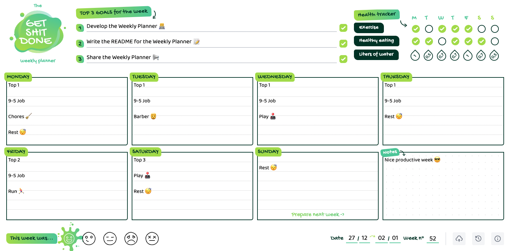

# Weekly Planner



[](https://planner-ricardopbarbosa.vercel.app)
[](http://makeapullrequest.com)
[](http://www.firsttimersonly.com/)

# Introduction

#### This is my personal weekly planner that I use since 2019. I started by doing the design (heavily inspired by [this planner](https://inkyinthewild.com/products/a4-weekly-planner-desk-pad-to-do-list-motivation-goal-setting-notepad-student-revision-agenda-office-notebook-organiser-with-health-tracker)) in Figma and printed it.

#### But now, after more than 100 pages printed, I see that it's not a scalable option, so I decided to make the web version of it. 🤷‍♂️

#### And decided to share it, in case it fits the needs of some other being out there in the vastness of space. 🔭

# Features

## History 🕒
Here you can see and edit the previous weeks (if there's data in them). You can also create an entry in the past as your heart desires.

## Local storage of your data (default)
You can opt by having your data on your browser storage only.

## Sync data to a cloud database ☁️
If you wish, you can link your google account, and sync the data to [Firebase](https://firebase.google.com/).

## PWA features
This is a PWA (Progressive Web App), which means that you can install it as an app, and use it offline. 

In case you have it synced with the cloud database when you go back online the data is synced automatically (if there are local changes, they are stored in the cloud, and if there are changes made on the database from another online device, they are synced to your local data storage).

# Run it locally

```sh
  # Clone this repository
  $ git clone https://github.com/RicardoPBarbosa/weekly-planner.git

  # Go into the repository
  $ cd weekly-planner

  # Install dependencies
  $ yarn # npm install

  # Setup the environment variables
  $ cp .env.example .env # and fill it with your own firebase info

  # Run the app
  $ yarn dev # npm run dev
```

# Support

<a href="https://www.buymeacoffee.com/ricardopbarbosa"></a>

# License
MIT
